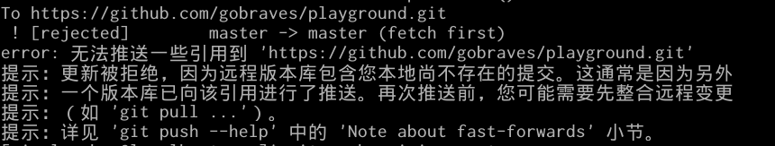

##git使用小记
>远程仓库都以playground为例
####1.配置github
####2.建立版本库
####3.初始化本地仓库
在项目目录下`git init`
or
在已有的git目录下`git clone https://github.com/gobraves/playground.git`
####4.将项目文件添加到版本库中
`git add`
####5.添加改动说明
`git commit -m "first commit"`
####6.将本地仓库与github项目仓库相关联
`git remote add origin https://github.com/gobraves/playground.git`
####7.将本地仓库的内容同步到远程仓库
`git push -u origin master`

如果遇到上面的问题，就参看git push --help咯
意思大概是，假设A和B基于同一个仓库的某个版本作出修改，但A先提交，当B再提交时，仓库的版本已经改变。记得之前看pro git的时候，记得有个head指针什么的，忘了。。。
此时，可以选择的方法：

- +master
- git pull,git push
- git pull --rebase
###8.回滚
未完待续
